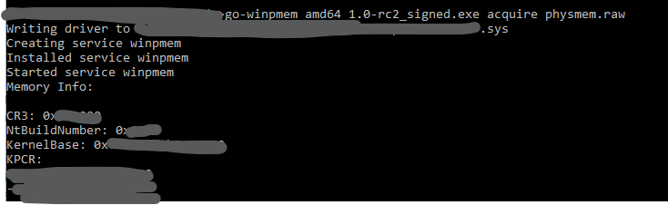
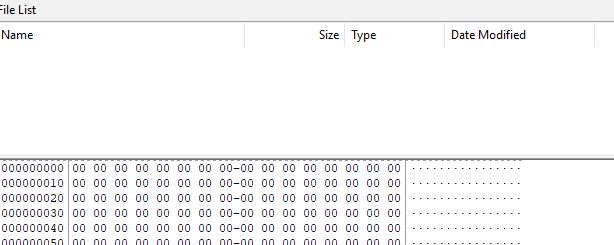

## Memory Forensics 

Memory forensics is the process of gathering the running memory of a device and then analyzing the captured output for evidence of malicious software.

On any given computer, everything you do such as opening files, browsing the web, or playing games traverses memory at some point. If we can dump the contents of memory to disk, there are many tools that can be used to extract different artifacts. Note that <b>"Disk"</b> just means any <b>persistent storage medium</b> where data can be written and survived after power is removed. For example, this could be a Hard Drive, USB Flash Drive or Solid State Drive. 

### What is Volatile Data? 

This type of <b>data only exists while the system is powered and running.</b> The moment power is lost, it is gone forever. 

One of the first reactions when dealing with an incident may be to power off the device to contain the threat. However, as mentioned, if powered off, any network connections and running processes will be lost, and so as the malware as that has been running in memory, thus, this data is lost. 

The best thing to do is to isolate the device from the rest of the network as it will securely contain the incident and preserve valuable evidence by not destroying the volatile data in memory. 

### What is a Memory Dump? 

A memory dump or RAM (Random Access Memory) dump is a snapshot of memory captured for memory analysis which contains data relating to any running processes at the time the capture was taken. 

- <b>Instead of imaging the hard drive first, capture RAM first:</b> A hard drive image might be `100GB+` which is slow to capture, slow to transfer, and slow to analyze. A RAM dump is typically `16-32GB` which is much faster to capture and transfer. 

    - It's a <b>triage strategy</b>, you can begin analyzing more information-rich capture (RAM) over waiting for the massive disk image to complete.

### How to capture RAM for analysis? 

If you need a RAM dump during an incident, the method differs depending what the device is. 

- <b>PHYSICAL Machine:</b> Capturing RAM from a physical device can be done using various tools. After doing some research, we are going to try to use <b>"WinPmem"</b>. Go to <a href="https://github.com/Velocidex/WinPmem/releases">WinPmem</a>, scroll down and download the `go-winpmem_amd64_1.0-rc2_signed.exe` Windows binary. Note that Windows Binary file is a a compiled, ready-to-run computer program designed specifically for the Windows operating system, containing machine-readable instructions rather than human-readable code. 

    - Once this is downloaded, <b>run CMD as Administrator</b>, then go to the path where the binary was downloaded. Once you are there, run the command `go-winpmem_amd64_1.0-rc2_signed.exe acquire physmem.raw`. This captures <b>your system's physical RAM (main memory) at the moment in time, a snapshot of everything in memory right now</b>. In my case, the file size was around 36GB as that is my installed RAM size.   

        

    - After the memory dump as been downloaded, we can use a tool called <b>FTK Imager</b> to view the dump as raw bytes/hex. It is useful for confirming the file exists. In short, download FTK imager from <a href="https://www.exterro.com/digital-forensics-software/ftk-imager">here</a>, open it, then click on `file` at the top right, `Add Evidence Item`, then `Image File`, then enter the source path, and finally, click on `Finish`. You would see something like this below: 

        
    
    - After that, we can use a tool called <b>Volatility</b> to do more of an analysis of the memory; I will talk more about this later. 

- <b>VIRTUAL machine:</b> Taking a snapshot from a VM will create a vmem file which can then be analyzed by a tool mentioned previously, Volatility. 

### Memory Forensic Tools 

- <b>Volatility</b>: This tool is great for Windows and Linux, where it is a command-line tool that lets you quickly pull out useful information such as processes that were running on a device, network connections, and processes that contain injected code. You can dump DDLs (Dynamic Link Library - shared code file used by program in Windows) as well for further analysis. Also, it supports the analysis of dumps from Unix devices and a wide range of plugins designed from the forensics community. 

- <b>Rekall</b>: This is also another tool like Volatility. 

- <b>Redline:</b> Instead of command-line driven tools like Volatility and Rekall, this is a GUI-driven tool. Also, the downside of using this, is that it only supports the analysis of Windows devices. 

### What to Look For in Memory Dumps 

A key principle of memory forensics is that <i>"malware can hide, but it must run.</i>. While malicious software may attempt to evade detection on disk, it must execute in memory, leaving behind artifacts that can be analyzed.

A strong starting point is examining <b>running processes</b>. We can do this by using the tools mentioned to enumerate active processes and identify anomalies. For instance, you come across a process name that you dont recognize, and so when googled, do any results show up? It is important to verify the following: 

- <b>Execution path</b> (e.g., system processes should run from `C:\Windows\System32`) 
- <b>Parent-child relationship</b> (unexpected parents may indicate process spawning abuse)
- <b>Process behaviour</b> (CPU usage, memory regions, loaded modules)

Analyzing <b>process trees</b> is critical as it lets us understand the parent-child relationship, basically which process started other processes. For example: 

    explorer.exe
    └── chrome.exe
      └── chrome.exe
      └── chrome.exe

For this, `explorer.exe` started `chrome.exe`, and then Chrome created more Chrome child processes. If we have something such as: 

    winword.exe
    └── powershell.exe

This is unusual since Microsoft word does not usually launch PowerShell. 

Attackers often attempt to blend in by using legitimate process names such as `svchost.exe`. However, these processes typically have-defined characteristics, including: 

- Known parent processes 
- Standard file locations 
- Expected command-line arguments 

In addition to process analysis, reviewing network connections is essential. Based on gathered information, I think we should look for: 

- Unusual outbound connections 
- Rare or high-numbered ports 
- Patterns such as repeated digits (e.g., `4444`, `1337`) often used by attackers

Beyond these, memory analysis can reveal advanced techniques such as: 

- <b>Process Injection</b> (malicious code running inside legitimate processes)
- <b>DLL Injection</b> (attackers force a legitimate process to load malicious `.dll`)
    - example: 
        
            explorer.exe
             └── loads evil.dll
- <b>Fileless malware</b> (malicious code exists only on RAM, often disappearing after a reboot)