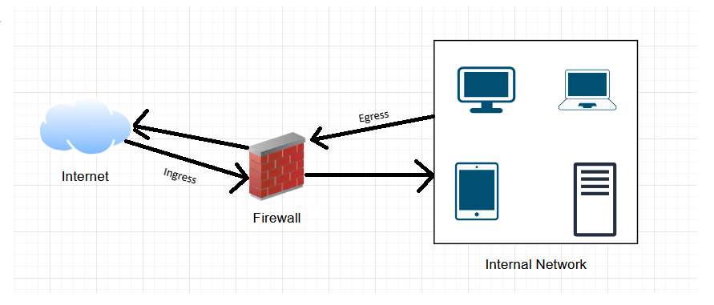
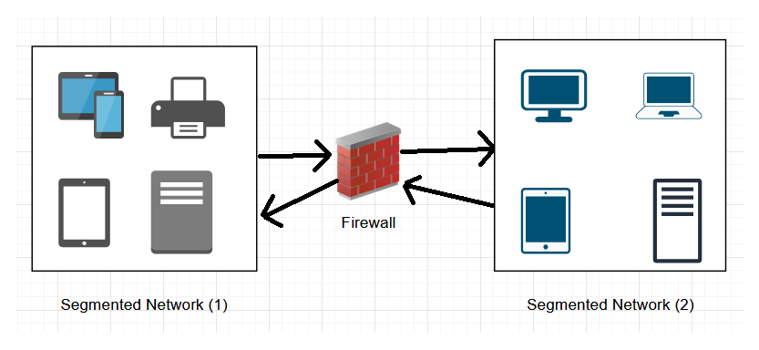
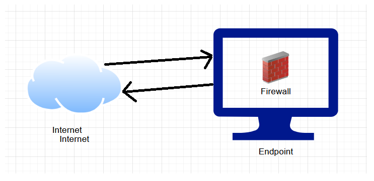

## Recap

A firewall is a security device, either hardware or software that monitors and controls traffic (ingress & egress). It makes decisions whether to allow or deny traffic base on specific rules (inbound % outbound). 

## Where Do Firewalls Sit? 

There are a couple of locations where the firewall can sit: 

- <b>Perimeter</b>: meaning the boundary/edge of a network. They usually sit between outside traffic and the internal network. When traffic comes from the internet, it `hits firewall first` before reaching internal systems.

    

- <b>Internal:</b> firewalls can also sit inside networks. <b>Internal Segmentation</b> is the splitting of a larger network where the <b>internal firewall</b> `sits between segmented networks`. 

    

- <b>Host-based:</b> The firewall sits on the and endpoint such as computer, which is also `software-based`. 

    

## Firewall Types

### Stateful vs. Stateless

- <b>Stateful firewalls (2nd gen):</b> remember the state of `active connections/sessions`. It tracks data such as: 
    - source IP
    - destination IP
    - source port 
    - destination port
    - protocol 
    - whether the connection was already established

    The firewall still checks rules, but remember it maintains a <b>State Table</b>. If the connection is allowed determined against the rules specified, the firewall creates a session entry into a state table. The firewall will remember any future packets that belong to that specific session. 

- <b>Stateless firewalls (1st gen):</b> does not remember sessions. It inspects each packet independently against rules `without remembering prior traffic`. 

    The difference between these firewalls is what happens with the `legitimate return traffic`. 

    With a <b>stateless firewall</b>, you may need rules to allow inbound return traffic, like: 

        allow inbound from web_server:443 to internal_client:ephemeral_port
    
    This is extremely messy because client ports are usually random high ports. 

    With <b>stateful firewalls</b>, you can say: 

        allow outbound HTTPS
    
    Stateless firewalls can block unsolicited inbound traffic using rules, but stateful firewalls make this safer and easier by allowing only inbound traffic that matches an established connection in the state table.

### Proxy Firewalls (Application-Level Gateways - Third Gen)

Instead of just checking IPs, ports, and sessions, they understand the <b>application protocol</b> itself. For example, these could be `HTTP`, `FTP`, `SMTP`, `DNS`.

A normal stateful firewall might see the following: 

    Client → Server
    TCP 443
    Allowed

However, a proxy firewall can inspect more deeply. For example, 

    Is this really HTTPS traffic?
    What URL is being requested?
    What HTTP method is being used?
    Is the file upload allowed?
    Is the command suspicious?

NOTE, "proxy" means the firewall can sit in between the client and the server. 

    Client → Proxy Firewall → Website

        
If a user tries to visit a website, the proxy firewall can check: 

- Is the website allowed? 
- Is the request using HTTP properly
- Is this actually web traffic? 

However, there are `drawbacks`: 

- Performance Overhead (latency since it is checking many things)
- Application-specific (Has to know content filtering)

### Next-Generation Firewalls (NGFWs)

This is modern firewall that combines `stateful firewall` + `application awareness` + `threat detection/prevention`

The core NGFW features include: 

- <b>Stateful inspection:</b> tracks active sessions
- <b>Application awareness:</b> identifies apps, not just ports
- <b>Deep packet inspection:</b> looks deeper into traffic contents
- <b>IDS/IPS:</b> detects or blocks known attack patterns
- <b>User identity awareness:</b> policies based on user/group
- <b>URL/content filtering:</b> blocks risky or unwanted websites
- <b>Malware/threat prevention:</b> scans files or suspicious traffic
- <b>SSL/TLS inspection:</b> can inspect encrypted traffic when configured

## Rule Set

Firewalls process rules in a specific order (typically top-down). Once a packet matches a rule, the action is taken. 

<b>Anatomy of a Rule</b>

- <b>Source:</b> IP, Network, User
- <b>Destination:</b> IP, Network, Service
- <b>Protocol:</b> TCP, SMTP, DNS, UDP, POP3
- <b>Port:</b> 53, 22, 110, 443, 445
- <b>Action:</b> Allow, Deny/Reject, Drop

## Benefits & Limitations

<b>Benefits</b>

- <b>Access Control:</b> Prevents unauthorized access.
- <b>Threat Protection:</b> Blocks port scans, DoS, and some malware.
- <b>Policy Enforcement:</b> Ensures adherence to security policies (regulatory or internal).
- <b>Logging & Auditing:</b> Provides traffic records for analysis (can be entered as evidence in court).

<b>Limitations</b>

- <b>Not a Silver Bullet:</b> One layer of defense, not complete.
- <b>Insider Threats:</b> Less effective against malicious insiders.
- <b>Sophisticated Attacks:</b> Can be bypassed by APTs/zero-days.
- <b>Misconfiguration:</b> A poorly configured firewall is a major risk.
- <b>Does NOT Protect Against:</b> Viruses within allowed traffic, phishing, and social engineering.